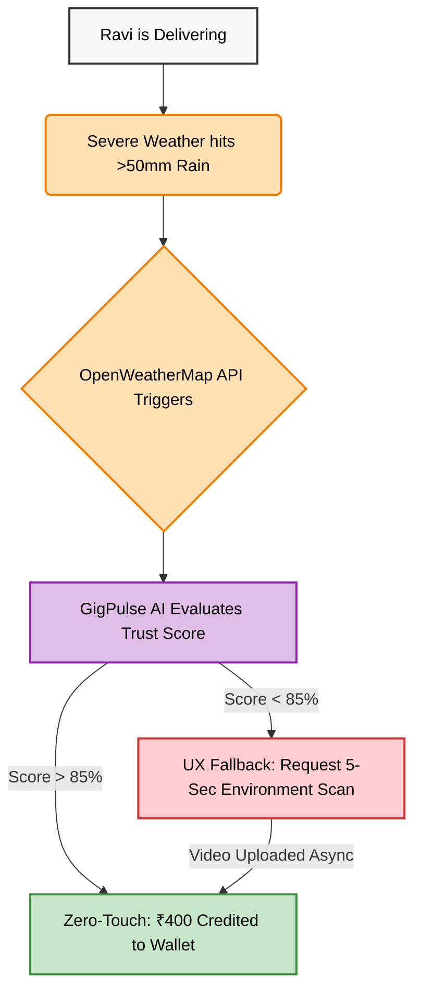

# 🦄 GigPulse Parametric
**Next-Generation InsurTech for India’s Gig Economy**

[](https://www.linkedin.com/posts/hari-haran-192b22328_fusionfour-guidewiredevtrails-unicornchase-ugcPost-7438502661471047680-MMfF/)
> *🏆 Building for the Guidewire DEVTrails 2026 "Unicorn Chase"*

## 📋 Executive Summary
GigPulse Parametric is a zero-touch, AI-driven micro-insurance platform built for India's 15 million+ gig workers. Designed to modernize insurance using next-generation tech, our platform provides instant, parameter-based payouts to delivery partners who lose wages due to severe weather, ensuring financial stability with zero claims, zero paperwork, and zero waiting.

## 🌩️ The Problem: A Day in the Life of Ravi
Meet Ravi, a 28-year-old delivery partner who relies on daily gig work to survive. On an average week, Ravi's income is steady. But when severe weather hits—like a sudden >50mm downpour—Ravi is forced off the road for his own safety. 

Because traditional insurance does not cover "lost wages" for gig workers, a single severe storm causes a devastating 20–30% loss in Ravi's weekly income. This massive demographic is left entirely unprotected against climate anomalies.

## 🏗️ Architecture & The Zero-Touch Flow
GigPulse utilizes a MERN stack architecture integrated with real-time weather APIs to trigger smart, parametric payouts.

### 🔄 The Zero-Touch Flowchart


## 🛡️ Adversarial Defense & Anti-Spoofing Strategy
To counter the recent exploitation by organized GPS-spoofing syndicates, GigPulse abandons basic geolocation reliance. We implemented a Gemini AI-powered Multidimensional Trust Score algorithm that evaluates three distinct telemetry pillars in real-time before authorizing any zero-touch payout.

> [!IMPORTANT]
> **👉 Read our full anti-spoofing architecture and Behavioral AI logic in our [SECURITY.md](./SECURITY.md) file.**

**A. Sensor Fusion (Physical Environment Validation)**
Spoofing software can fake a digital coordinate, but it cannot fake physics. The React frontend continuously polls the device hardware:
* **Micro-Vibration Analysis:** A gig worker on a two-wheeler in a storm generates a chaotic acceleration signature. A spoofed phone lying on a desk generates a flatline `[0,0,0]` XYZ signature. We feed this time-series `DeviceMotionEvent` data into the Gemini API to detect non-human, algorithmic anomalies that standard hard-coded threshold checks might miss.
* **Atmospheric Pressure:** Utilizing the device barometer, we cross-reference local pressure drops with meteorological data to confirm the presence of a storm system.

**B. Network Triangulation (Digital Footprint Validation)**
We validate the physical GPS coordinate against the surrounding digital infrastructure by hashing nearby Wi-Fi MAC addresses and local Cell Tower IDs.

**C. The UX Balance: "Trust but Verify"**
If our AI flags a claim as suspicious, or if a genuine hardware/network failure drops a user's Trust Score below 85%, we do not outright reject honest workers like Ravi. Instead, the automated payout pauses and our fallback loop triggers:
1. **Local Capture:** The app prompts Ravi for a 5-second "Environment Scan" (a video of the rain).
2. **Cryptographic Hashing:** The video is instantly hashed (SHA-256) alongside the localized timestamp to prevent the use of old, pre-recorded videos.
3. **Asynchronous Upload:** The compressed payload waits in local storage until a stable connection is re-established, ensuring fair payouts even in poor storm connectivity.

## Telemetry Payload Example
```JSON
{
  "claimId": "chk_98765xyz",
  "userId": "ravi_swig_102",
  "gps": {
    "lat": 13.0827,
    "lng": 80.2707,
    "accuracy": "15m"
  },
  "telemetry": {
    "accelerometer_variance": 4.22, 
    "barometer_hPa": 998.5,
    "wifi_bssids_hashed": ["a1b2c", "d3e4f"]
  },
  "trustScore": 92.4,
  "status": "APPROVED_FOR_PAYOUT"
}
```
## 💰 4. The Financial Engine: Parametric Revenue Model

To scale as a "Unicorn" InsurTech, GigPulse utilizes a High-Velocity Micro-Premium Model. By automating the claims process, we eliminate 90% of traditional administrative overhead, allowing us to pass those savings directly to the gig workers.

### 📊 Actuarial Trigger Matrix

Our payouts are binary and "Zero-Touch." When the OpenWeatherMap API confirms a breach of these thresholds, the smart contract executes the payout immediately.


📈 The Revenue & Sustainability Model
The Micro-Subscription: Workers pay a weekly "Protection Fee" of ₹70. This is priced to be less than the cost of a single meal, making it accessible to 100% of the gig workforce.

Dynamic Solvency Pool: 85% of all premiums are locked into a Decentralized Liquidity Pool. Because extreme weather is geographically isolated (e.g., it rains in Chennai but not in Bangalore), the "Float" from unaffected regions provides the capital for the affected regions.

Gemini-Optimized Pricing: We use the Gemini API to analyze historical weather patterns vs. payout frequency, allowing us to adjust the ₹70 premium in real-time to ensure the platform remains profitable even during heavy monsoon months.

👥 Team Fusion Four

Hari Haran K - Team Lead & Product Strategy

Subha R - UI/UX Architect & Full-Stack Developer

Kavipriya P - Business Logic & Persona Data Modeling

Chandrisha P G - AI Integration & Security Architecture
