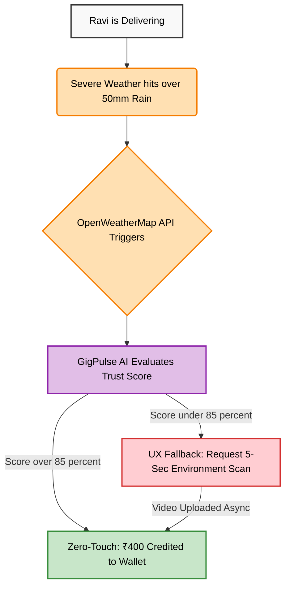

# 🦄 GigPulse Parametric
**Next-Generation InsurTech for India’s 15M+ Gig Workers**

[](https://www.linkedin.com/posts/hari-haran-192b22328_fusionfour-guidewiredevtrails-unicornchase-ugcPost-7438502661471047680-MMfF/)
> *🏆 Official Entry for the Guidewire DEVTrails 2026 "Unicorn Chase"*

[](https://gig-pulse-parametric-fusion-four-de.vercel.app/)
[](https://gigpulse-parametric-fusion-four-devtrails.onrender.com)

---

## 🚀 The Elevator Pitch
**GigPulse is an AI-driven parametric insurance platform designed to protect India’s 15 million gig workers from climate-induced income loss.** By combining real-time weather oracles with a Gemini-powered 'Trust Engine' and bank-grade idempotency, we deliver instant, fraud-proof payouts the moment a storm hits—transforming unpredictable weather into predictable financial security.

### 🔄 The Zero-Touch Architecture Flow

## 📽️ Mandatory Links

### 📊 Pitch Deck
> 🚀 **[View High-Resolution Pitch Deck (Google Drive) →](https://drive.google.com/file/d/1n9kFh5nnzzMrtMKwbLGT5rVrqNi46bE0/view?usp=sharing)**
> *Comprehensive overview of the GigPulse product strategy and business model.*

### 🎬 Demo Video
> 🎥 **[Watch the "Happy Path" Demo Video (YouTube/Loom) →](PASTE_YOUR_VIDEO_LINK_HERE)**
> *End-to-end demonstration of the parametric insurance claim flow and AI validation.*

### 📄 Technical Whitepaper
> 📖 **[Read the System Architecture & Technical Specifications (PDF) →](https://drive.google.com/file/d/1uYbhqCRrvSwlLvf7Hnq9Eu24ctL3lWyC/view?usp=sharing)**
> *Detailed teardown of our sensor fusion architecture and idempotency engine.*

### 🛡️ Security & Business Impact
> 📖 **[Read the Adversarial Resilience & Case Studies Report (BUSINESS_IMPACT.md) →](./BUSINESS_IMPACT.md)**
> *Real-world scenarios detailing GigPulse's fraud-prevention solvency and UX strategy.*

## 🏆 Technical Highlights (Why We Win)
* **The Steel Trap (Idempotency):** We implemented deterministic idempotency keys and atomic database locks to solve the "Retry Problem," preventing double-spending during unstable network conditions.
* **Multidimensional Sensor Fusion:** Beyond GPS, our system analyzes accelerometer and barometer signatures via Gemini 1.5 Flash to verify that a rider is actually in the rain, defeating emulator-based fraud.
* **Production-Ready Resilience:** The backend features SIGTERM listeners for graceful shutdowns and a `/api/health` heartbeat route for real-time diagnostic telemetry.

---

## ⚡ Key Innovation: The "Steel Trap" Idempotency Engine
In a high-velocity parametric system, double-payouts are a fatal risk. GigPulse implements a sophisticated **Idempotency Layer**—our "Steel Trap"—that guarantees exactly one payout per user, per event, per day.

### How it Works:
1. **Deterministic Key Generation**: Every claim request generates a unique `claim_lock_{userId}_{YYYY-MM-DD}` key.
2. **Atomic Database Locks**: We leverage MongoDB's unique indexing on the `idempotencyKey` field. 
3. **Collision Handling**: If a second request hits the backend (even within the same millisecond), the database rejects the insertion, returning a `429 Too Many Requests` status.
4. **Visual Locking**: The React frontend locks the claim state immediately upon the first click, ensuring the UI and API are perfectly synced.
## 🧠 AI Trust Engine: Sensor Fusion via Gemini 1.5 Flash
Spoofing GPS is easy; spoofing physics is impossible. GigPulse uses **Google Gemini 1.5 Flash** to analyze a multidimensional telemetry payload:


*Figure: The Sensor Fusion Architecture. Raw micro-vibrations and multi-axis accelerometer telemetry from the claimant's device are seamlessly processed by Gemini 1.5 Flash. By analyzing the chaotic physical signatures, the AI robustly verifies true physical locomotion, completely isolating and defeating location-spoofed claims based on immutable physical evidence.*

| Pillar | Data Source | Validation Logic |
| :--- | :--- | :--- |
| **Physical Activity** | `Accelerometer` | Detects the chaotic vibration signature of a moving two-wheeler vs. a static spoofed device. |
| **Atmospheric Pressure**| `Barometer` | Cross-references device-level pressure drops with local storm systems from OpenWeatherMap. |
| **Environment Scan** | `Camera/Video` | Fallback loop for suspicious claims requiring a 5-second video hash. |

### 📡 Example Sensor Fusion Payload
```json
{
  "claimId": "chk_98765xyz",
  "userId": "ravi_swig_102",
  "gps": {
    "lat": 13.0827,
    "lng": 80.2707,
    "accuracy": "15m"
  },
  "telemetry": {
    "accelerometer_variance": 4.22, 
    "barometer_hPa": 998.5,
    "wifi_bssids_hashed": ["a1b2c", "d3e4f"]
  },
  "trustScore": 92.4,
  "status": "APPROVED_FOR_PAYOUT"
}
```
### 🔐 Deep Dive: Anti-Fraud Mechanics
> 📖 **[Read our full Security & Anti-Fraud Architecture (SECURITY.md) →](./SECURITY.md)**
> *Explore our dedicated documentation on Behavioral Continuity, Network Triangulation, and Trust-Centered Fallbacks.*

---

## 💰 The Financial Engine: Parametric Revenue Model
To scale as a "Unicorn" InsurTech, GigPulse utilizes a High-Velocity Micro-Premium Model, passing saved administrative overhead directly to gig workers.

* **The Micro-Subscription:** Workers pay a weekly "Protection Fee" of ₹70 (less than a single meal).
* **Dynamic Solvency Pool:** 85% of premiums are locked into a Decentralized Liquidity Pool. Because extreme weather is geographically isolated, the "Float" from unaffected regions funds the payouts for affected regions.
* **Gemini-Optimized Pricing:** Gemini API analyzes historical weather patterns vs. payout frequency to adjust premiums dynamically, ensuring platform profitability during heavy monsoons.

---

## 🛠️ Technical Stack
* **Frontend:** React 19, Tailwind 4, Framer Motion (Deployed on **Vercel Edge**).
* **Backend:** Node.js, Express (Deployed on Render).
* **Database:** MongoDB Atlas with atomic unique constraints.
* **AI:** Google Gemini 1.5 Flash (LLM-based Sensor Fusion).
* **DevOps:** Implemented **Graceful Shutdown (SIGTERM)** handling to ensure connection integrity during redeployments.
---
---

## 📸 Interface Preview & Visual Evidence

### Transaction Ledger


*Figure 1: Professional Transaction Ledger featuring transparent status indication, zebra-striping, and a high-end financial tool aesthetic.*

### Security & Fraud Hub


*Figure 2: Security & Fraud Hub. The UI successfully demonstrates a 'Diamond Tier' verification paired with an outstanding 92% AI Trust Score, validating secure telemetry sensor fusion.*

---

## 🚀 Quick Start Guide

### 1. Prerequisites
* Node.js (v18+)
* MongoDB Atlas Account
* Google Gemini API Key
* OpenWeatherMap API Key

### 2. Backend Setup
```bash
cd server
npm install
# Create .env file with:
# MONGO_URI=your_mongo_uri
# GEMINI_API_KEY=your_gemini_key
# OPENWEATHER_API_KEY=your_weather_key
npm start
```
### 3. Frontend Setup
```bash
cd client
npm install
# Create .env file with:
# VITE_API_URL=http://localhost:5000
npm run dev
```
## 🙏 Acknowledgments
* **Guidewire:** For hosting the incredible DEVTrails 2026 "Unicorn Chase" Hackathon and inspiring this solution.
* **Google Gemini:** For powering our multidimensional Sensor Fusion AI.
* **OpenWeatherMap:** For the reliable, real-time parametric weather telemetry.
* **Razorpay:** For enabling our zero-touch, high-velocity payout engine.

---

## 👥 Team Fusion Four
* **Hari Haran K** - Team Lead & Product Strategy
* **Subha R** - UI/UX Architect & Full-Stack Developer
* **Kavipriya P** - Business Logic & Persona Data Modeling
* **Chandrisha P G** - AI Integration & Security Architecture

---
> Built with ❤️ for India’s Gig Warriors.

